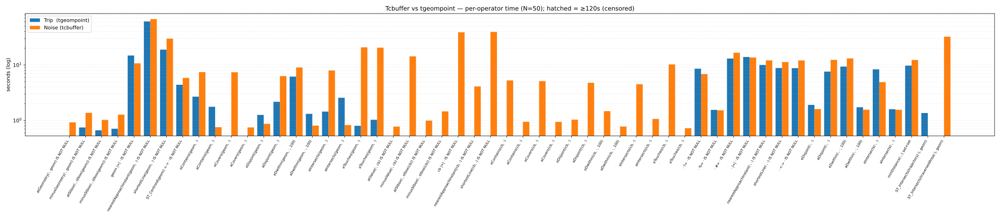

# Tcbuffer vs tgeompoint — timing catalog (N=50)

One full day of Danish AIS · MobilityDB `MobilityDB 1.4.0` · generated from the notebook.

**Headline** — noise-only protected-area reaches: **67** (noise 79 vs centerline 12).

| Section | Operator | Trip (s) | Noise (s) | Noise/Trip |
|---|---|---:|---:|---:|
| A - Trip x geometry: tgeompoint vs tcbuffer | `atGeometry(·, geom) IS NOT NULL` |  | 0.927 |  |
| A - Trip x geometry: tgeompoint vs tcbuffer | `atStbox(·, stbox(geom)) IS NOT NULL` | 0.666 | 1.026 | 1.5× |
| A - Trip x geometry: tgeompoint vs tcbuffer | `minusGeometry(·, geom) IS NOT NULL` | 0.749 | 1.374 | 1.8× |
| A - Trip x geometry: tgeompoint vs tcbuffer | `minusStbox(·, stbox(geom)) IS NOT NULL` | 0.711 | 1.276 | 1.8× |
| A - Trip x geometry: tgeompoint vs tcbuffer | `ST_Centroid(geom) <-> · IS NOT NULL` | 4.403 | 5.844 | 1.3× |
| A - Trip x geometry: tgeompoint vs tcbuffer | `geom |=| · IS NOT NULL` | 14.828 | 10.727 | 0.7× |
| A - Trip x geometry: tgeompoint vs tcbuffer | `nearestApproachInstant(geom, ·) IS NOT NULL` | 61.034 | 67.047 | 1.1× |
| A - Trip x geometry: tgeompoint vs tcbuffer | `shortestLine(geom, ·) IS NOT NULL` | 18.906 | 29.860 | 1.6× |
| A - Trip x geometry: tgeompoint vs tcbuffer | `aContains(geom, ·)` | 1.766 | 0.757 | 0.4× |
| A - Trip x geometry: tgeompoint vs tcbuffer | `aCovers(geom, ·)` |  | 0.751 |  |
| A - Trip x geometry: tgeompoint vs tcbuffer | `aDisjoint(geom, ·)` | 2.171 | 6.318 | 2.9× |
| A - Trip x geometry: tgeompoint vs tcbuffer | `aDwithin(geom, ·, 100)` | 1.318 | 0.809 | 0.6× |
| A - Trip x geometry: tgeompoint vs tcbuffer | `aIntersects(geom, ·)` | 2.567 | 0.827 | 0.3× |
| A - Trip x geometry: tgeompoint vs tcbuffer | `aTouches(geom, ·)` | 1.030 | 20.512 | 19.9× |
| A - Trip x geometry: tgeompoint vs tcbuffer | `eContains(geom, ·)` | 2.687 | 7.452 | 2.8× |
| A - Trip x geometry: tgeompoint vs tcbuffer | `eCovers(geom, ·)` |  | 7.411 |  |
| A - Trip x geometry: tgeompoint vs tcbuffer | `eDisjoint(geom, ·)` | 1.261 | 0.870 | 0.7× |
| A - Trip x geometry: tgeompoint vs tcbuffer | `eDwithin(geom, ·, 100)` | 6.183 | 9.031 | 1.5× |
| A - Trip x geometry: tgeompoint vs tcbuffer | `eIntersects(geom, ·)` | 1.447 | 7.961 | 5.5× |
| A - Trip x geometry: tgeompoint vs tcbuffer | `eTouches(geom, ·)` | 0.804 | 20.799 | 25.9× |
| B - Trip x cbuffer (tcbuffer only) | `atStbox(·, stbox(cb)) IS NOT NULL` |  | 0.995 |  |
| B - Trip x cbuffer (tcbuffer only) | `atValue(·, cb) IS NOT NULL` |  | 0.775 |  |
| B - Trip x cbuffer (tcbuffer only) | `minusStbox(·, stbox(cb)) IS NOT NULL` |  | 1.460 |  |
| B - Trip x cbuffer (tcbuffer only) | `minusValue(·, cb) IS NOT NULL` |  | 14.320 |  |
| B - Trip x cbuffer (tcbuffer only) | `cb |=| · IS NOT NULL` |  | 38.802 |  |
| B - Trip x cbuffer (tcbuffer only) | `nearestApproachInstant(cb, ·) IS NOT NULL` |  | 4.108 |  |
| B - Trip x cbuffer (tcbuffer only) | `shortestLine(cb, ·) IS NOT NULL` |  | 39.423 |  |
| B - Trip x cbuffer (tcbuffer only) | `aContains(cb, ·)` |  | 0.948 |  |
| B - Trip x cbuffer (tcbuffer only) | `aCovers(cb, ·)` |  | 0.945 |  |
| B - Trip x cbuffer (tcbuffer only) | `aDisjoint(cb, ·)` |  | 4.776 |  |
| B - Trip x cbuffer (tcbuffer only) | `aDwithin(cb, ·, 100)` |  | 0.779 |  |
| B - Trip x cbuffer (tcbuffer only) | `aIntersects(cb, ·)` |  | 1.067 |  |
| B - Trip x cbuffer (tcbuffer only) | `aTouches(cb, ·)` |  | 0.726 |  |
| B - Trip x cbuffer (tcbuffer only) | `eContains(cb, ·)` |  | 5.278 |  |
| B - Trip x cbuffer (tcbuffer only) | `eCovers(cb, ·)` |  | 5.133 |  |
| B - Trip x cbuffer (tcbuffer only) | `eDisjoint(cb, ·)` |  | 1.034 |  |
| B - Trip x cbuffer (tcbuffer only) | `eDwithin(cb, ·, 100)` |  | 1.473 |  |
| B - Trip x cbuffer (tcbuffer only) | `eIntersects(cb, ·)` |  | 4.491 |  |
| B - Trip x cbuffer (tcbuffer only) | `eTouches(cb, ·)` |  | 10.255 |  |
| C - Trip x Trip: tgeompoint vs tcbuffer | `· #= · IS NOT NULL` | 13.072 | 16.615 | 1.3× |
| C - Trip x Trip: tgeompoint vs tcbuffer | `· %= · IS NOT NULL` | 1.553 | 1.526 | 1.0× |
| C - Trip x Trip: tgeompoint vs tcbuffer | `· ?= · IS NOT NULL` | 8.570 | 6.863 | 0.8× |
| C - Trip x Trip: tgeompoint vs tcbuffer | `nearestApproachInstant(·, ·) IS NOT NULL` | 10.016 | 12.113 | 1.2× |
| C - Trip x Trip: tgeompoint vs tcbuffer | `shortestLine(·, ·) IS NOT NULL` | 8.805 | 11.304 | 1.3× |
| C - Trip x Trip: tgeompoint vs tcbuffer | `· <-> · IS NOT NULL` | 8.767 | 12.082 | 1.4× |
| C - Trip x Trip: tgeompoint vs tcbuffer | `· |=| · IS NOT NULL` | 13.948 | 13.639 | 1.0× |
| C - Trip x Trip: tgeompoint vs tcbuffer | `aDisjoint(·, ·)` | 7.600 | 12.360 | 1.6× |
| C - Trip x Trip: tgeompoint vs tcbuffer | `aDwithin(·, ·, 100)` | 1.734 | 1.564 | 0.9× |
| C - Trip x Trip: tgeompoint vs tcbuffer | `aIntersects(·, ·)` | 1.599 | 1.559 | 1.0× |
| C - Trip x Trip: tgeompoint vs tcbuffer | `eDisjoint(·, ·)` | 1.910 | 1.606 | 0.8× |
| C - Trip x Trip: tgeompoint vs tcbuffer | `eDwithin(·, ·, 100)` | 9.373 | 13.115 | 1.4× |
| C - Trip x Trip: tgeompoint vs tcbuffer | `eIntersects(·, ·)` | 8.348 | 4.916 | 0.6× |
| C - Trip x Trip: tgeompoint vs tcbuffer | `minDistance(·,·) set×set` | 9.734 | 12.311 | 1.3× |
| D - Expressiveness showcase: cumulative noise vs centerline | `ST_Intersects(trajectory(·), geom)` | 1.365 |  |  |
| D - Expressiveness showcase: cumulative noise vs centerline | `ST_Intersects(traversedArea(·), geom)` |  | 32.342 |  |
| D - Expressiveness showcase: cumulative noise vs centerline | `ST_Intersects(traversedArea(·), geom) AND NOT ST_Intersects(trajectory(·), geom)` |  |  |  |

_0 operator(s) censored at the 120s cap against full-resolution multipolygons._

